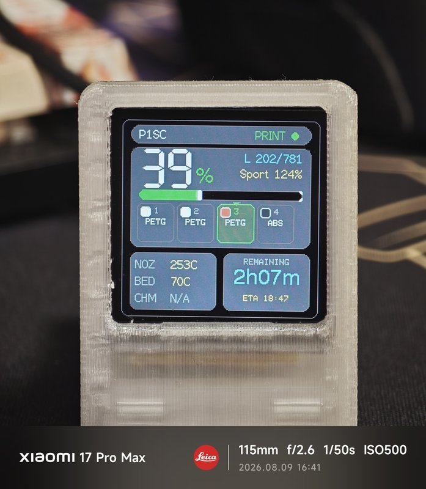
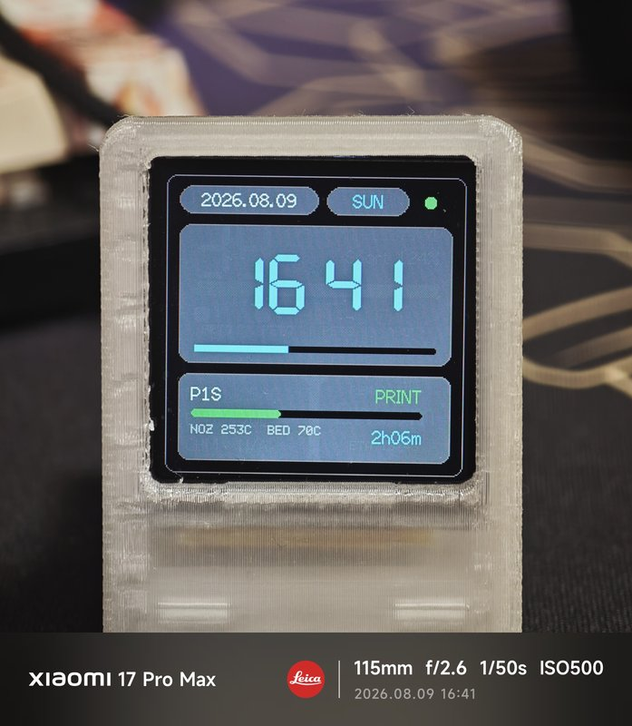
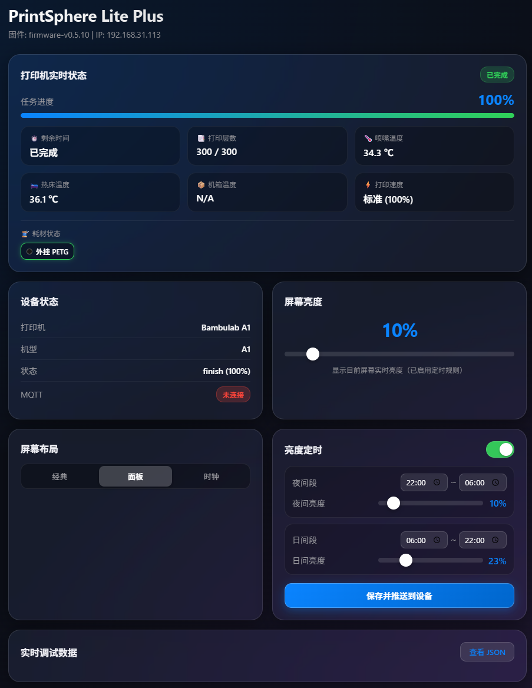

[ English Version ](README_en.md) | [ 简体中文 ](README.md)

# PrintSphere Lite Plus (Fork 版本)


本项目为原版 [PrintSphere Lite](https://github.com/ccord34/printsphere-lite) 的增强改进版本（Fork）。基于 ESP8266EX 与 240x240 ST7789 屏幕，专为 Bambu Lab（拓竹）3D 打印机打造的桌面打印状态与 AMS 耗材监控小电视。

---

## 📌 Fork 版本具体改动与新特性

### 1. 🌈 AMS（拓竹多色系统）与外挂料盘（Ext Spool）显示支持
* **多色耗材与外挂料盘渲染**：全面支持 Bambu AMS 槽位状态实时解析，准确识别每个槽位的耗材颜色、材质类型与加载状态。
* **无 AMS 场景自适应排版**：自动识别打印机是否接入 AMS（解析 `ams_exist_bits`）。无 AMS 时自动隐藏后 3 个冗余空槽位，只在首位以 `ext` 显示外挂料盘，排版更加紧凑优雅。
* **官方与第三方耗材智能区分**：
  * 自动校验 `tag_uid` RFID 标签码。
  * **官方耗材**（含 RFID）：精准显示剩余容量百分比（如 `85%`）。
  * **第三方 / 无 RFID 耗材**（Generic/外置料槽等）：自动隐藏余量百分比，只保留色块与材质简称（如 `PLA`、`PETG` 等），避免不准确的余量误导。
* **BGR565 颜色校正**：针对 ST7789 屏幕算法重新校正 RGB/BGR565 颜色编码，实现逼真的耗材色彩显示。
* **智能清除机制**：打印结束、取消或处于空闲状态时，自动清理 AMS 及打印速率指示，流畅切回待机/时钟界面。

### 2. 📊 屏幕 UI 与显示布局优化
* **信息面板 (Dashboard) 重写**：采用 2x2 精简数据卡布局，同时展示打印进度、喷嘴温度、热床温度、仓温以及估计剩余完成时间。
* **双喷嘴与多机型兼容**：针对 A1/A1 mini、P1P/P1S、P2S、X1C、X2D、H2 系列等不同机型优化温度与双喷嘴切换显示，避免长数值或多喷嘴文本遮挡。
* **屏幕背光控制**：支持 0-100% 自由亮度滑块调节，无有效任务 5 分钟后可自动进入低功耗降亮状态。

### 3. 🌐 Web 配置工具 (WebUI Backend) 升级
* **纯净紧凑界面**：全新设计的 Web 配置页，响应迅速、减少空白堆叠；支持按 WiFi 扫描配置、打印机切换、屏幕布局选择进行分组控制。
* **多设备档案管理**：单个 Bambu 云账号支持管理多台 ESP 硬件，系统按 MAC 地址与 Chip ID 自动隔离与保存各台设备的专属配置。
* **USB 串口优先**：所有配置写入优先走 USB 串口传输，HTTP 局域网传输作为兜底，解决多台设备同时在网时的误写问题。

### 4. 🧹 仓库代码库优化与安全脱敏
* **敏感隐私自动屏蔽**：更新 `.gitignore` 规则，将包含 WiFi 密码、Bambu 云 Token、打印机 Access Code 的配置文件（`config.json` 等）自动忽略，防止隐私泄露。
* **本地备份隔离**：本地支持保留开发与历史备份文件（`*.bak`），但自动拦截上云，保持 GitHub 代码库纯净轻量。
* **源码瘦身**：剔除冗余的大文件及中间调试脚本，极大地提升了克隆与推送速度。

### 5. ⚡ ESP 内置 Web 8081 服务与长时间运行稳定性加固 (v0.5.00)
* **零堆开销流式响应**：重构 ESP8266 内置 Web 管理页面为 PROGMEM 逐段流式输出，将页面请求时的动态堆内存峰值降为 0 字节，彻底杜绝小内存设备因页面请求导致的内存碎片化与 OOM 崩溃。
* **端口假死自愈守护**：深度修复 lwIP 底层 `_listen_pcb` 异常释放引发的“端口失活但标记已启动”僵死 bug，新增 `isEspServerListening()` 监听活性校验，失效自动重新拉起服务。
* **Wi-Fi 偶发抖动保护**：移除了 Wi-Fi 信号波动/偶发丢包时主动注销 Web 监听 Socket 的破坏性逻辑，防止频繁重建导致底层 TCP PCB 堆积耗尽。
* **投机连接防阻塞优化**：现代浏览器并发预连接采用 100ms 超时快速丢弃，请求行等待超时由 2000ms 收紧至 600ms，杜绝长时间占有 CPU 阻塞主循环与 MQTT 接收。
* **前端智能静默轮询**：后台轮询放宽至 8 秒并绑定页面可见性检测（`!document.hidden`），标签页处于后台或息屏时完全停止请求，根治 `TIME_WAIT` 堆积占用。

### 6. 📱 网页端实时监控大盘与双端口无缝访问 (v0.5.10)
* **全宽「打印机实时状态」独立卡片**：内置 Web 页面新增深色毛玻璃拟态监控大盘，集成当前任务动态状态胶囊（打印中、准备中、已暂停、已完成、待机）、双色平滑渐变进度条及 24px 大字号进度读数。
* **六宫格关键运行指标实时呈现**：实时展示预计剩余时间（自动转换为小时/分钟）、当前层数与总层数、精确到 0.1 ℃ 的喷嘴与热床温度读数、机箱温度，以及根据拓竹档位自动映射的打印速度（静音 50%、标准 100%、运动 124%、狂暴 166%）。
* **AMS / 外挂耗材槽位胶囊**：动态渲染当前装载的耗材色块与材质标签，供料中的槽位带有动态高亮绿色边框光晕；第三方无 RFID 耗材自动隐藏余量百分比，只保留色块与材质简称，避免误导性估算。
* **无仓温传感器机型智能规避 (N/A)**：针对 A1、A1 mini、P1P、P1S 等无硬件仓温传感器的机型，智能过滤并屏蔽云端返回的伪占位读数（5℃），页面统一规范显示为 `N/A`。
* **80 / 8081 双端口同时监听**：设备同时开放默认 80 HTTP 端口与 8081 端口，手机端无需手动输入 `:8081` 端口号，直接在浏览器输入 `http://<IP>` 即可秒级进入管理后台。
* **设备卡片状态行精简**：移除状态行中重复拼贴的喷嘴温度显示，状态行仅专注呈现任务与进度状态。

### 7. 🚀 Web 服务高性能流式传输与跨端全兼容加固 (v0.5.13)
* **根除异常断开死循环与看门狗复位**：彻底解决浏览器提前断开或刷新时 `ChunkedBufferedPrinter` 因缓冲指针未重置引发的 `while(size > 0)` 死循环，消除硬件看门狗超时复位（WDT Reset），增加断开秒级速退机制。
* **分块缓冲 MSS 精确适配与零碎片**：缓冲大小优化为 1024 字节，单分块连同头部与终止符仅 1031 字节，完美装入单个 TCP MSS（1460 字节），彻底消除分包引起的 Delayed ACK 200ms 卡顿，并节省 436 字节 RAM。
* **数据就绪优先接纳与宽容等待**：重构 `handleApiClient()`，优先处理 `hasClientData()` 已就绪连接（0ms 延时）；针对手机 Wi-Fi 节能模式连接提供 600ms 宽容等待并协同 `ESP.wdtFeed()` / `optimistic_yield(1000)`，彻底修复同网关下移动设备 100% 无法访问后台的问题。
* **彻底移除 `client.flush()` 致命死锁**：彻底根除 ESP8266 内核 5000ms 的 `wait_until_acked` 阻塞，杜绝与浏览器 200ms TCP 延迟确认（Delayed ACK）冲突导致的单片机主循环卡死与屏幕冻结。

### 8. 🛡️ MQTT 返回值有效性校验、断线自动重连与状态显示加固 (v0.5.14)
* **全链路拦截底层无效返回值**：`mqttSendPing()`（心跳）、`publishMqttRequest()`（状态查询）与 `mqttSendPuback()` 均加入底层写入字节数严格校验，一旦写入失败立即触发自动重连；`mqttReadPacket()` 遇到读取失败或负值 header 时主动关闭 socket 并启动重连，彻底防止 BearSSL/lwIP 半开假死。
* **协议层断开包与解析异常防御**：新增 MQTT DISCONNECT (Type 14) 协议包识别；连续 3 次 JSON 解析失败自动判定流乱序并重启连接。
* **彻底消除断连误判死循环**：排除了由于时间戳计算导致握手后误判超时的恶性断连死循环，保持 MQTT 链路持久稳定。
* **彻底修复「有数据更新右上角仍显示 OFFLINE」Bug**：重构 `isPrinterOnline()` 判定逻辑，接收到打印机有效遥测数据时实时精准展示 `PRINT` / `PREP` / `PAUSE` / `DONE` / `ERR` / `IDLE` 状态指示；仅在网络彻底断开或打印机明确处于离线时才显示 `OFFLINE`。
* **修复断连屏幕空白与无信息**：同一台设备断线重连时保留最后有效数据，不再暴力将指标清空为 `--`，提升离线时的可读性。

---

## 🖼️ 界面与实机效果预览

| 信息面板布局 (Dashboard + AMS) | 时钟待机布局 (Clock) |
| :---: | :---: |
|  |  |

### Web 后端配置界面
<p align="center">
  
</p>

---

## 🏷️ 版本号信息

* **固件版本 (Firmware)**：`v0.5.14`
* **后端配置工具 (Backend WebUI)**：`v0.4.71-ui-clean`

---

## 📁 目录结构

```text
src/              ESP8266 固件核心 C++ 源码 (main.cpp, config.h)
include/          TFT_eSPI 屏幕驱动引脚配置
后端配置工具/     Windows Web 配置工具 (server.js, 打开配置工具.bat)
固件/             预编译好的 printsphere-lite-esp8266.bin
刷固件工具/       Windows 平台一键烧录工具与 USB 串口驱动
docs/             设计说明与相关文档
platformio.ini    PlatformIO 项目构建配置文件
build-release.ps1 生成完整发布包脚本
```

---

## 🛠️ 硬件需求与引脚连接

* **主控**：ESP8266EX / NodeMCU 兼容开发板
* **屏幕**：240x240 7针 ST7789 SPI 显示屏
* **外壳**：外壳模型可选择https://makerworld.com.cn/zh/models/2587841-cheng-ben-25-printsphere-litetuo-zhu-da-yin-zhuang#profileId-2978954
* **接线参考 (PlatformIO 默认)**：
  * `CS`: GPIO 15
  * `DC`: GPIO 0
  * `RST`: GPIO 2
  * `BL`: GPIO 5 (PWM 背光控制)

---

## 🚀 快速上手使用

1. 使用 USB 线将 ESP8266 连接到 Windows 电脑。
2. 打开 `后端配置工具\打开配置工具.bat`，在自动打开的浏览器页面中登录 Bambu Lab 账号。
3. 选择或填写 2.4G WiFi 名称与密码，点击 **“保存并配置 ESP WiFi”**。
4. 刷新打印机列表，选中你的拓竹打印机并点击 **“显示这台并同步”**。
5. ESP8266 屏幕出现数据后即可拔下电脑 USB，改用任意 5V USB 供电使用。
6. 设备连上 WiFi 后，也可以通过浏览器直接访问 `http://[ESP的局域网IP]:8081/` 进行轻量无线管理。

---

## 💻 编译与构建

项目基于 [PlatformIO](https://platformio.org/) 构建，如需修改源码并自行编译：

```bash
# 编译 ESP8266 固件
platformio run -e sd2
```

编译产物路径：`.pio/build/sd2/firmware.bin`

---

## 📄 License 与致谢

* 本项目基于 [ccord34/printsphere-lite](https://github.com/ccord34/printsphere-lite) 原项目进行修改和增强。
* 本项目仅供个人学习、交流及非商业用途使用。商业使用、批量生产或集成付费服务需获得原作者授权。详细声明见 [LICENSE](LICENSE)。
